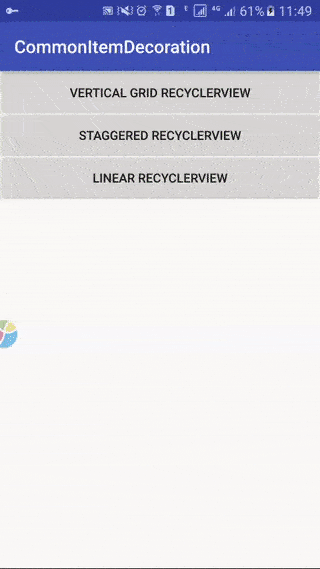

# A custom ItemDecoration which appends dividers(with same thickness) between items(with same dimension) for RecyclerView

[中文版](README_zh.md)

When using RecyclerView, we often need set dividers between items. Usually, we set right_margin to the root layout of each item. In this way, you hava to set a left_margin to the RecyclerView to make the list looks symmetric. There's another way to do this. We can customize ItemDecoration and override the getItemOffsets method. Also, set `right` to the parameter `outRect` to each item. And add `left` to the first item. In this way, you will find that the width between the first and other items are not the same.

So this `SCommonItemDecoration` is the best way. It supports LinearLayoutManager, GridLayoutManager and StaggeredGridLayoutManager, also supports different orientation.

### Usage

You need first initailize a `SparseArray` of `SCommonItemDecoration.ItemDecorationProps` which contains properties for different type of items.

```
SparseArray<SCommonItemDecoration.ItemDecorationProps> propMap = new SparseArray<>();
```

`SCommonItemDecoration.ItemDecorationProps` inculdes these fields:

```
private int verticalSpace; 
private int horizontalSpace; 
private boolean hasVerticalEdge; 
private boolean hasHorizontalEdge;
```

After set these fields of `ItemDecorationProps`, new a `SCommonItemDecoration` and set it to the RecyclerView:

```
mBrandRecyclerView.addItemDecoration(new SCommonItemDecoration(propMap));
```

That's all, enjoy youself.


